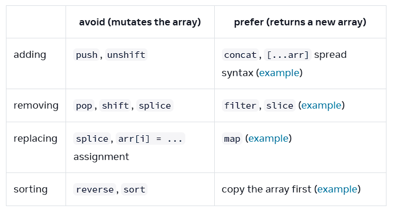

# Fullstackopen Notes


## JavaScript Notes

Update object by copying & merging new and existing fields (immutable)
- Done via "spread" operator
- Also overrides existing properties
    ```js
    // Example
    const obj1 = { foo: "bar", x: 42 };
    const obj2 = { foo: "baz", y: 13 };

    // Creates new copy of object w/ updated fields
    const mergedObj = { x: 41, ...obj1, ...obj2, y: 9 }; // { x: 42, foo: "baz", y: 9 }
    ```

Updating array, mutation vs non-mutation
    


```js
// ----------------------------------
// Adding item to array
// A) push (mutable)
artists.push({id: nextId++, name: name})
// B) spread operator
updatedArtists = [...artists, {id: nextId++, name: name}]
// C) concat
updatedArtists = artists.contact({id: nextId++, name: name})

// ----------------------------------
// Removing item from array
// filter (immutable)
updatedArtists = artists.filter(a => a.id !== artistToRemove.id)

// ----------------------------------
// Replacing item(s) in array
// A) direct replacement (mutable)
let counters = [0,0,0]
counters[position] = counter[position] + 1
// B) .map()
let updatedCounters = counters.map((c, p) => {
    if (p == position)
        return c + 1
    else
        return c
})
```

Destructuring arrays

```js
const t = [1, 2, 3, 4, 5]

const [first, second, ...rest] = t

console.log(first, second)  // 1 2 is printed
console.log(rest)          // [3, 4, 5] is printed
```

Destructuring objects
- Ex: `const { name, age } = props`

Updating object properties
- Can use dot notation or brackets, ex: `object1['secret number'] = 12341`

## React Notes

Create react app: 
- `npm create vite@latest . -- --template react`


## Svelte Notes

Create svelte app: 
- `npx sv create`

## Misc notes

Same Origin Policy / CORS
- URL's origin is defined by protocol/scheme, hostname, and port
  - Ex: 
  ```
    http://example.com:80/index.html
    
    protocol: http
    host: example.com
    port: 80
  ```
- How it works:
  - A) Browser requests website server
  - B) Server sends HTML file (which may contain external references)
  - C) Browser sends request for each of the external references (URLs)
  - D) If the URL has same origin as original server, then browser processes the response w/o any issues
  - E) If URL does not have same origin, then browser will check the `Access-Control-Allow-Origin` response header
    - If it contains `*` on the URL of the source HTML, browser will process the response
    - If it does not contain `*`, browser will refuse to process, and throw CORS error
- This means that javascript code running in browser can only communicate with a server in the same origin, unless that server specifies in the header that it will accept that origin's request
  - so if your backend is running on port 3001 and your frontend code was served on port 3000, the frontend code won't be able to make requests to the backend due to different origins, caused by backend not allowing the access
- Helps prevent security vulnerabilities like session hijacking
- To allow script in HTML file served by server to access external resources, the external server must send headers to tell browser which origins they will permit for access

- How to handle CORS issue
  - You can install `cors` and set it up as middleware on the backend
  - Or, you can setup proxy options in Vite and set "changeOrigin" to true so the external requests are changed to match the origin of the backend server